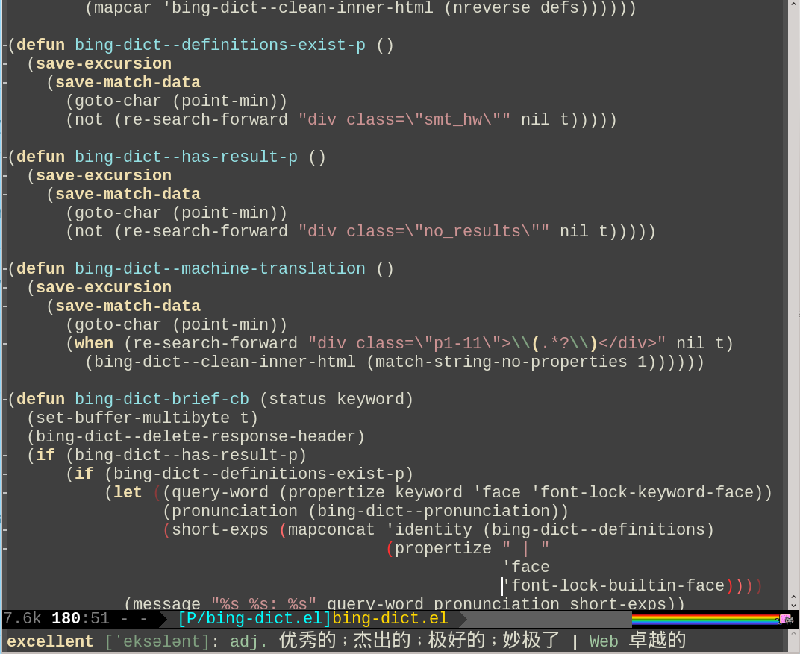

# bing-dict.el
[](http://melpa.org/#/bing-dict)
[](http://stable.melpa.org/#/bing-dict)

A **minimalists'** Emacs extension to search http://www.bing.com/dict.
Support English to Chinese and Chinese to English.

极简主义者的 Emacs 必应词典。 支持中英互译。

## Setup

You can install via [melpa](http://melpa.org).

If installing this package manually:

    (add-to-list 'load-path "/path/to/bing-dict.el")
    (require 'bing-dict)

## Usage
You can call `bing-dict-brief` to get the explanations of you query. The results
will be shown in the echo area.

Here is the screenshot:



You should probably give this command a key binding:

    (global-set-key (kbd "C-c d") 'bing-dict-brief)

## Customization
You can set the value of `bing-dict-add-to-kill-ring` to control whether the
result should be added to the `kill-ring` or not. By default, the value is
`nil`. If set to `t`, the result will be added to the `kill-ring` and you are
able to use `C-y` to paste the result.

Also, sometimes synonyms and antonyms could be useful, set
`bing-dict-show-thesaurus` to control whether you need them or not. The value of
`bing-dict-show-thesaurus` could be either `nil`, `'synonym`, `'antonym` or
`'both`. The default value is `nil`. Setting the vaule to `'synonym` or
`'antonym` only shows the corresponding part, and setting it to `'both` will
show both synonyms and antonyms at the same time:

    (setq bing-dict-show-thesaurus 'both)

The variable `bing-dict-pronunciation-style` controls how the pronunciation is
shown. By default, its value is `'us` and the pronunciation is shown using
"American Phonetic Alphabet" (APA). You can choose the "International Phonetic
Alphabet" (IPA) by setting its value to `'uk` (In fact, any value other than
`'us` will work):

    (setq bing-dict-pronunciation-style 'uk)

## As for More Features...
This extension aims for a quick search for a word. I don't plan to parse all the
sections of the search results. If you want to view the complete results of your
query word, I suggest using the external browser to do this. The following code
could partly achieve the goal:

    (browse-url
     (concat "http://www.bing.com/dict/search?mkt=zh-cn&q="
           (url-hexify-string
            (read-string "Query: "))))

If you prefer to browse inside Emacs, use `eww` instead:

```
(eww-browse-url
  (concat "http://www.bing.com/dict/search?mkt=zh-cn&q="
          (url-hexify-string
           (read-string "Query: "))))
```

Or open the web page in other window:

```
(switch-to-buffer-other-window
 (eww-browse-url
  (concat "http://www.bing.com/dict/search?mkt=zh-cn&q="
          (url-hexify-string
           (read-string "Query: ")))))
```
